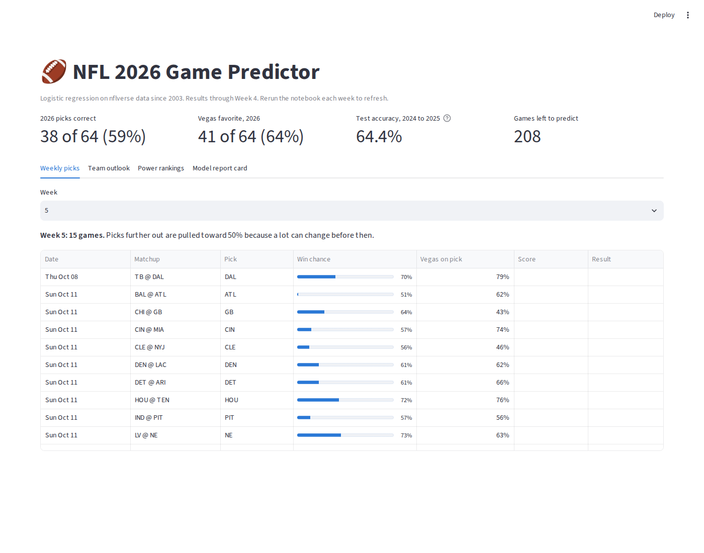

# NFL Game Predictor (2026 season)

A side project where I try to predict the winner of every NFL game in the 2026 season. It pulls data from nflverse, builds features for each game, trains a logistic regression model, and shows everything in a Streamlit dashboard. I rerun it every Tuesday after the week's games are done, and each week's picks get saved before kickoff so the record stays honest.

Dashboard: [add link]

## How it did

To test it, I trained on 2005 through 2023 and had it predict the 2024 and 2025 seasons, which it had never seen.

| | Picked correctly | Brier score |
|---|---|---|
| Always pick the home team | 54.0% | 0.249 |
| Elo rating only | 65.6% | 0.217 |
| My model | 64.4% | 0.214 |
| Vegas favorite | 68.4% | 0.206 |

It beats the home team baseline by a lot and still trails Vegas. Elo on its own picked a few more winners, but my model had the better Brier score, which grades the probabilities and not just the picks. Since the dashboard shows win chances, that is the number I care about more.

## What goes into it

The data is every game and every play since 2003 from nflverse, loaded with the nflreadpy package.

For each game the model looks at:

- the difference in Elo rating between the two teams
- each starting quarterback's EPA per dropback over his last 16 games
- how well each defense has been playing lately (EPA allowed)
- rest days, travel across time zones, neutral site games, division games, and whether a team changed quarterbacks

Everything is calculated from games played before kickoff, so the model never sees the result it is trying to predict.

Games further in the future get pulled a little toward 50%. When I backtested past seasons, the model was too confident about games many weeks away, so I measured how much and adjusted for it.

## Things I learned

I also tried XGBoost. Out of the box it scored worse than guessing 50% on every game across ten seasons of validation. After tuning it got close, but it still trailed logistic regression (64.0% to 65.3%), so I went with the simpler model. On the 2024 and 2025 test, tuned XGBoost actually came out ahead (66.0% to 64.4%, about nine games over two seasons). I had already picked the model before looking at the test, so I kept that choice instead of switching after seeing the answer.

At one point I had team offense EPA and the quarterback rating in the model together. They were mostly measuring the same thing, which made the weights hard to trust, so I dropped team offense EPA. The model got simpler and a little better.

The model got off to a slow start in the first three weeks of 2026. I wanted to start changing things, but that is only 48 games, so any change had to prove itself on ten past seasons first.

## Files

- `notebook/` the Colab notebook with every step
- `nfl_app/app.py` the dashboard
- `nfl_app/*.csv` the data the dashboard reads, updated weekly
- `images/` screenshots

Data from nflverse (CC BY 4.0). Not affiliated with the NFL.
